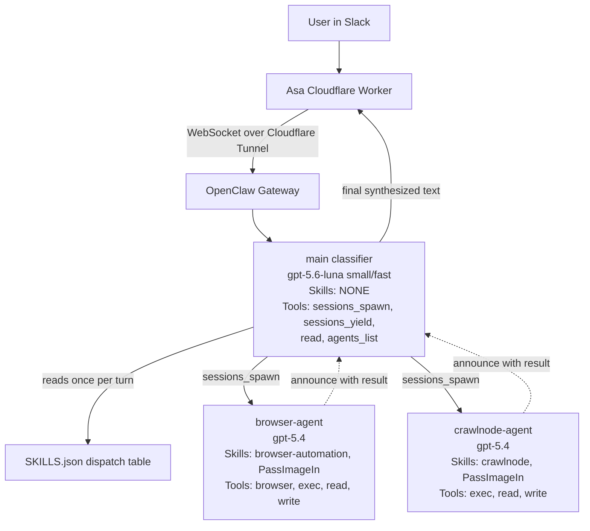
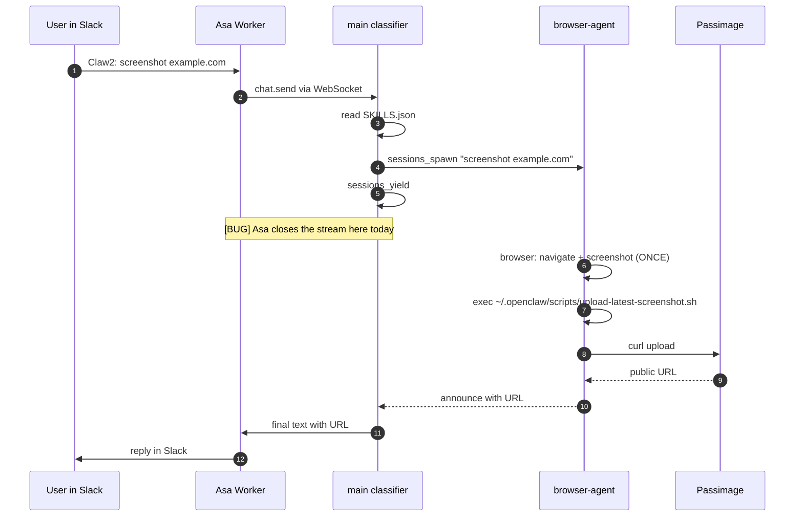

# OpenClaw Multi-Agent Design

**Status:** LIVE on Claw2. Claw1 pending (machine offline in office at time of writing).
**Last updated:** August 24, 2026.
**Applies to:** OpenClaw gateways running on Claw1 and Claw2, driven by the [Asa Cloudflare Worker](https://github.com/linkgrid/asa-cf-worker.autoscale.team) from Slack.

Written in plain language for non-developers. Every technical term is explained in the glossary below.

> **Known open bug (Aug 24 2026):** Slack requests still fail with `_No response._` even after two Asa-side patches (protocol version negotiation and per-yield terminal suppression). CLI runs on Claw2 succeed end-to-end. The Cloudflare Worker's `chat()` generator terminates after the parent's `sessions_yield` in ways we haven't fully diagnosed. **See section 11 "Known issues" and the handoff notes at the bottom of this doc.**

---

## 0) Glossary — read this first

If you already know these, skip. If a section confuses you later, come back here.

| Term | Plain-English meaning |
|---|---|
| **Agent** | One AI "brain" with its own workspace, memory, tools, and personality. OpenClaw hosts multiple agents on the same machine, each isolated from the others. On each Claw we now have three: `main`, `browser-agent`, `crawlnode-agent`. |
| **Skill** | A markdown instructions file (`SKILL.md`) that tells an agent how to do one specific job (e.g. take a screenshot). It's like a company procedures manual — not code, just prose the AI reads. |
| **Workspace** | A folder on disk that is one agent's "home." Contains its `AGENTS.md` (personality/rules), local files, memory. Each agent has a separate one. |
| **`AGENTS.md`** | The system prompt for one agent. Auto-loaded by OpenClaw every time that agent starts a session. Think of it as the agent's job description. |
| **`SKILLS.json`** | A small table listing every skill available on the machine, what each does, and which skills chain together (e.g. `browser-automation` chains with `passimagein`). |
| **`sessions_spawn`** | Built-in OpenClaw tool. One agent uses it to hand a task to another agent. Non-blocking — the caller doesn't wait. |
| **`sessions_yield`** | Built-in OpenClaw tool. After spawning, the caller uses this to say "wake me up when the child finishes." |
| **Depth** | How deep the agent-calling-agent tree goes. Classifier = depth 0. Specialist = depth 1. We cap at 1 (specialists cannot spawn further). |
| **Announce** | When a specialist finishes, OpenClaw automatically delivers its result back to the caller as a new user message. That delivery is called an "announce." |
| **Classifier** | The `main` agent. Its only job is to pick which specialist should handle each request. It doesn't do the work itself. |
| **Specialist** | Sub-agents that do the actual work (`browser-agent`, `crawlnode-agent`). Each has a narrow skill set. |
| **`refresh-openclaw.sh`** | A bash script on each Claw that pulls this repo from GitHub and installs every skill, AGENTS.md, helper script, and config change, then restarts the gateway. See section 8. |
| **Overlay** | `openclaw-config/multi-agent-overlay.json5`. A partial OpenClaw config that gets merged into `~/.openclaw/openclaw.json` via `openclaw config patch`. Non-invasive: only touches the `agents` and `acp` sections. |

---

## 1) Problem statement

Previously a single OpenClaw agent per Claw did everything: read the user's Slack message, chose whichever skill file it thought was relevant, and executed the tools itself. Two failure modes repeated:

1. **Skipped mandatory steps.** The agent took a screenshot but forgot to upload it to Passimage, so the Slack reply said "here's the screenshot" with no URL.
2. **Improvisation after failure.** When the built-in browser tool errored out, the agent tried `exec google-chrome`, `exec chromium`, then wrote a Python script — until it hit its 25-minute or 45-tool-call limit and returned nothing ("spiraling").

Root cause: **one brain had to remember all the rules for all the skills at once**, and it dropped some.

## 2) Target architecture (live on Claw2 today)



## 3) Component responsibilities

| Component | Where it lives | Job |
|---|---|---|
| **`main` classifier agent** | `~/.openclaw/workspace/AGENTS.md` on each Claw | Read `SKILLS.json`, pick specialist, `sessions_spawn` it, `sessions_yield`, forward the specialist's reply. |
| **`browser-agent` specialist** | `~/.openclaw/workspace-browser/AGENTS.md` | Drives Chromium via `browser`. Captures screenshots. Uploads via the helper script (see section 6). |
| **`crawlnode-agent` specialist** | `~/.openclaw/workspace-crawlnode/AGENTS.md` | Hits the CrawlNode HTTP API via `exec curl`. Uploads results via passimagein. |
| **`SKILLS.json`** | Root of this repo | Dispatch table the classifier reads. Source of truth for what specialists exist. |
| **`SKILL.md` files** | `browser-automation/`, `crawlnode/`, `passimagein/` | Per-skill instructions filtered per-agent via the overlay. |
| **`AGENTS.md` files** | `agents/main/`, `agents/browser-agent/`, `agents/crawlnode-agent/` | System prompts. Each folder also has a one-line `WORKSPACE` file pointing at the target directory on the Claw. |
| **`multi-agent-overlay.json5`** | `openclaw-config/` | Config chunk merged into `~/.openclaw/openclaw.json` via `openclaw config patch`. Defines agents.list[], per-agent tools/skills/model, ACP defaults. |
| **`upload-latest-screenshot.sh`** | `openclaw-config/scripts/` | Helper script `browser-agent` calls to upload the newest screenshot. Exists because of a real gotcha — see section 6. |
| **`refresh-openclaw.sh`** | `openclaw-config/scripts/` + installed to `~/scripts/` on each Claw | The one-command deploy. See section 8. |

## 4) Intended data flow (a screenshot request)



Steps 1–5 and 7–12 work when run from the OpenClaw CLI directly on Claw2. Steps 6–12 do NOT complete via the Slack/Asa path today.

## 5) OpenClaw config quirks we hit (write these down)

These are **not** in OpenClaw's public docs. All discovered by trial + gateway-log spelunking on Aug 24 2026 against OpenClaw `2026.6.34`.

### 5.1 Schema is `agents.list[]`, not `agents.entries.{}`

The docs on `docs.openclaw.ai/tools/skills-config` show `agents.entries.<id> = {...}` (an object keyed by agent id). The actual runtime schema (per `openclaw config schema`) is `agents.list = [ {id, ...}, ... ]` (an array). The `openclaw config patch` command RE­PLACES arrays wholesale, so the overlay's `list` is the full source of truth for what agents exist.

### 5.2 Tool inheritance: subagents inherit the parent's tool allowlist

When `main` calls `sessions_spawn` for `browser-agent`, the spawned session inherits `main`'s **effective tool allowlist**. If `main.tools.allow` only lists `sessions_spawn`/`sessions_yield`/`read`, the subagent literally cannot see the `browser` tool — regardless of what `browser-agent.tools.alsoAllow` says.

**Workaround (currently applied):** `main.tools.allow` includes `browser`, `exec`, `write` so the subagent inherits them. `main`'s AGENTS.md prompt is very explicit: "You never do the work yourself. Never call browser/exec/write." Policy is enforced by prompt; config just widens the inherited set.

### 5.3 Model resolution for subagents

Setting `browser-agent.model = openrouter/openai/gpt-5.4` alone does NOT force spawned children to use that model — the parent's `sessions_spawn` call passes an explicit `model` argument that overrides. So the classifier can (and sometimes does) pass whatever model it wants.

**Workaround (currently applied):** `main.subagents.model = openrouter/openai/gpt-5.4` sits as a default. In practice we've seen `main` still pass whatever it feels like in the `sessions_spawn` arguments. Not fully solved — needs a prompt change in `agents/main/AGENTS.md` telling `main` to omit the `model` field.

### 5.4 The `browser: screenshot` tool doesn't return the file path

Since `2026.6.x`, `browser: screenshot` saves the PNG to `~/.openclaw/media/browser/<uuid>.png` but returns to the LLM only the **vision-model description** of what the image contains. The file path is stripped. Any AGENTS.md prompt telling the model "grab `details.path` and upload it" will loop forever — the model retries the screenshot hoping to see the path.

**Workaround (currently applied):** `browser-agent/AGENTS.md` has HARD RULE #8 ("never call screenshot more than once") and points the agent at `~/.openclaw/scripts/upload-latest-screenshot.sh`, which finds the newest PNG with `ls -t` and uploads it in one command. Section 6 describes this.

## 6) The helper-script pattern (`upload-latest-screenshot.sh`)

To sidestep quirk 5.4 without depending on which LLM the specialist is running as, every non-trivial "produce a file → upload it" step is packaged as a shell script the agent calls via `exec`. The script:

- Finds the newest PNG in `~/.openclaw/media/browser/`.
- Reads `PASSIMAGE_FILES_API_KEY` from the gateway's env (loaded from `~/.openclaw/.env` by systemd).
- Uploads via `curl` and prints the resulting public URL on stdout.
- Prints `ERROR: <reason>` to stderr and exits non-zero if anything fails.

**Why a script instead of inline `exec`:** small models like `gpt-5.6-luna` sometimes truncate long env-var names into ellipses (we observed `$PASSI…_KEY` in the trajectory logs). A script name is a short, hard-to-mangle string. Same reasoning for any future "make a thing → share the thing" helper.

## 7) Repo layout

```
openclaw-skills/                           (this repo)
├── DESIGN.md                              this file
├── README.md                              plain-English intro
├── SKILLS.json                            classifier's dispatch table
├── browser-automation/SKILL.md            unchanged skill (loaded into browser-agent)
├── crawlnode/                             unchanged skill (loaded into crawlnode-agent)
│   ├── SKILL.md
│   ├── docs/CRAWLNODE-API-DOCUMENTATION.md
│   └── scripts/test-crawlnode.sh
├── passimagein/SKILL.md                   unchanged (loaded into every specialist)
├── agents/                                per-agent prompts (new Aug 24 2026)
│   ├── main/
│   │   ├── AGENTS.md                      classifier prompt
│   │   └── WORKSPACE                      "$HOME/.openclaw/workspace"
│   ├── browser-agent/
│   │   ├── AGENTS.md                      browser specialist prompt
│   │   └── WORKSPACE                      "$HOME/.openclaw/workspace-browser"
│   └── crawlnode-agent/
│       ├── AGENTS.md                      crawlnode specialist prompt
│       └── WORKSPACE                      "$HOME/.openclaw/workspace-crawlnode"
└── openclaw-config/                       config + deploy (new Aug 24 2026)
    ├── multi-agent-overlay.json5          config chunk applied via `openclaw config patch`
    └── scripts/
        ├── refresh-openclaw.sh            the one-command deploy
        └── upload-latest-screenshot.sh    passimage helper called by browser-agent via exec
```

## 8) Deploy mechanism (`refresh-openclaw.sh`)

Run on each Claw as: `~/scripts/refresh-openclaw.sh`. Steps in order:

1. `git clone --depth 1` this repo into `/tmp/openclaw-skills-pull`.
2. Sync top-level skill folders (`browser-automation/`, `crawlnode/`, `passimagein/`) into `~/.openclaw/skills/`. Copy `SKILLS.json`.
3. For each `agents/<name>/AGENTS.md`, copy it to the path in that folder's `WORKSPACE` file. Timestamped backup of the previous version if it differed.
4. Copy every `openclaw-config/scripts/*.sh` (except `refresh-openclaw.sh` itself) into `~/.openclaw/scripts/`, `chmod +x`.
5. Sync `openclaw-config/patches/*.sh` into `~/.openclaw/patches/`, install the systemd drop-in `~/.config/systemd/user/openclaw-gateway.service.d/patch-guard.conf` adding `ExecStartPre=~/.openclaw/scripts/patch-guard.sh`, `daemon-reload`, and run `patch-guard.sh` immediately once. See section 8.1.
6. Run `openclaw config patch --file openclaw-config/multi-agent-overlay.json5` — dry-run first, then apply. Output logged to `/tmp/openclaw-refresh-overlay.log`.
7. Self-update: copy the repo's `refresh-openclaw.sh` over `~/scripts/refresh-openclaw.sh` so future runs use the freshest version.
8. Restart the OpenClaw gateway via `systemctl --user`.

Idempotent, safe to re-run. Exits non-zero on the first failure.

**Practical note discovered Aug 24:** when invoked through certain non-interactive SSH wrappers (like a plain `ssh user@host '~/scripts/refresh-openclaw.sh'`), the openclaw CLI subprocess sometimes gets SIGKILL'd mid-run. Run it in an interactive SSH session (`ssh -t`) or detached (`nohup ... < /dev/null &`) to avoid this. Direct invocation on the machine itself works fine.

### 8.1) Gateway patches (survive `npm update -g openclaw`)

Some OpenClaw bugs can only be fixed by editing the gateway's own JavaScript source inside `~/.npm-global/lib/node_modules/openclaw/dist/`. Because those files are npm-installed, a future `npm update -g openclaw` would silently wipe any hand-edits and bring the bugs back.

We solve this with a **patches folder + doormat** pattern:

- **`openclaw-config/patches/NNN-name.sh`** — each patch is a small, idempotent bash script that (a) checks whether its target is already patched, (b) applies the change with `sed` (or similar) if not, (c) exits 0 either way. If application fails, the script restores from a timestamped `.bak-*` backup and exits non-zero.
- **`openclaw-config/scripts/patch-guard.sh`** — the doormat. Walks `~/.openclaw/patches/*.sh` and executes each one. Idempotency lives inside each patch script.
- **systemd drop-in** at `~/.config/systemd/user/openclaw-gateway.service.d/patch-guard.conf` adds `ExecStartPre=~/.openclaw/scripts/patch-guard.sh` to the gateway unit. Result: every gateway start — reboot, manual restart, or post-`npm update` — first runs the doormat, which re-applies any patches that got clobbered. No operator action required after an OpenClaw upgrade.

**Current patches (Aug 24 2026):**

| Patch | What it fixes |
|---|---|
| `001-force-full-context.sh` | Hard-codes 3 places in `openclaw-tools-*.js` so `params.lightContext` is treated as `false` regardless of what the classifier sent. Vanilla OpenClaw lets the LLM classifier decide `lightContext` per spawn, which flips run-to-run and randomly ships subagents without their AGENTS.md rulebook — the root cause of the browser-agent screenshot loop / timeout observed on Aug 24. |

**Diagnostics:**

- `ls ~/.openclaw/patches/` — what's installed on the Claw right now.
- `journalctl --user -u openclaw-gateway | grep patch-guard` — the guard's last log lines (e.g. `[patch-guard] 1/1 patch(es) ok, 0 failed`).
- Each patch prints its own status: `[001-force-full-context] already applied (3/3 markers)` or `[001-force-full-context] applied (3/3 markers, backup: ...)`.

**Adding a new patch:** drop `NNN-something.sh` into `openclaw-config/patches/` (copy the shape of `001-force-full-context.sh`), commit, push, run `~/scripts/refresh-openclaw.sh` on each Claw. No script or systemd change needed.

**Retiring a patch:** delete its file from `openclaw-config/patches/` in the repo. Next `refresh-openclaw.sh` run will remove it from `~/.openclaw/patches/` on each Claw. The underlying source file will be re-vanilla-fied on the next `npm update -g openclaw`, or you can manually copy back from the `.bak-*` next to the target file.

## 9) Cost estimate

| Component per request | Cost |
|---|---|
| Classifier turn (`gpt-5.6-luna`, ~1000 in / 200 out tokens) | ~$0.001 |
| Specialist turn (`gpt-5.4`) | ~$0.05 |
| **Total** | **~$0.051** (about 2% more than the pre-refactor single-agent flow) |

## 10) Non-goals

- **No changes to Asa's runtime code required by design.** In practice we made two small Asa-side patches to handle OpenClaw 2026.6.34's newer wire protocol and its `sessions_yield` behaviour — see section 11 and the Asa repo's commit history.
- **No use of OpenClaw channel bindings for content-based routing.** The classifier prompt does that instead.
- **No nested sub-agents (`maxSpawnDepth: 1`).** Specialists cannot spawn further.
- **No separate `passimagein-agent`.** Passimage is loaded into every specialist as a shared skill.

## 11) Known issues (Aug 24 2026)

### 11.1 Slack path still returns `_No response._`

CLI tests on Claw2 work end-to-end (`~/.npm-global/bin/openclaw agent --agent main -m 'take a screenshot of https://example.com'` returns a valid Passimage URL). Slack tests do NOT — the Asa worker terminates the run after `sessions_yield` and before `browser-agent` produces any output.

**Fixes shipped in the Asa Cloudflare Worker so far (commits on `main`):**

- `1e095fa fix(openclaw): accept gateway protocol v3 OR v4 during connect` — needed after Claw2 upgraded from 2026.4.2 to 2026.6.34.
- `fcb4831 fix(openclaw): keep listening after sessions_yield in multi-agent runs` — first attempt at suppression, only caught `stopReason=lifecycle_end`.
- `99b8e2f fix(openclaw): suppress every premature terminal after sessions_yield` — counter-based suppression for `end_turn` / `stop` / `length` / `content_filter` / `lifecycle_end` / `chat_aborted`.

**Symptom after those fixes deployed:** Slack still shows main's tool calls (`read` → `sessions_spawn` → `sessions_yield`) then a blank line, `View full thread`, then `_No response._`. The subagent apparently never starts (nothing in `~/.openclaw/agents/browser-agent/sessions/` newer than the last CLI test).

**Suspected areas to investigate next:**

- The `sessions_spawn` from Slack passes `"model": "openrouter/openai/gpt-5.6-luna"` explicitly. The CLI-successful runs passed `openrouter/openai/gpt-5.4`. Model routing may be silently rejecting the spawn.
- The overlay's `main.subagents.model` may not be enforced when the classifier passes an explicit `model` in `sessions_spawn` args.
- Asa may still be counting suppressions incorrectly. The new counter increments on `sessions_yield` only, not `sessions_spawn`. If the gateway emits a `chat_final` between the `sessions_spawn` tool_call_end and the `sessions_yield` tool_call_start, the counter wouldn't catch it.
- Cloudflare Worker CPU/subrequest budgets may be closing the WebSocket. Check the Worker's real-time logs during the failing request.

### 11.2 Two orthogonal quirks documented above (5.2, 5.3, 5.4)

Section 5 describes them. Any future skill/agent work should read that section first.

## 12) Related documents

- [asa-cf-worker.autoscale.team](https://github.com/linkgrid/asa-cf-worker.autoscale.team) — the Slack-facing side.
- `docs/OPENCLAW_WORKING_CONTEXT.md` in the Asa repo — day-to-day OpenClaw operations reference.
- OpenClaw upstream docs (used to inform this design, but see section 5 for where they disagree with reality):
  - `https://docs.openclaw.ai/concepts/multi-agent`
  - `https://docs.openclaw.ai/tools/subagents`
  - `https://docs.openclaw.ai/concepts/agent-workspace`
  - `https://docs.openclaw.ai/tools/skills-config`
