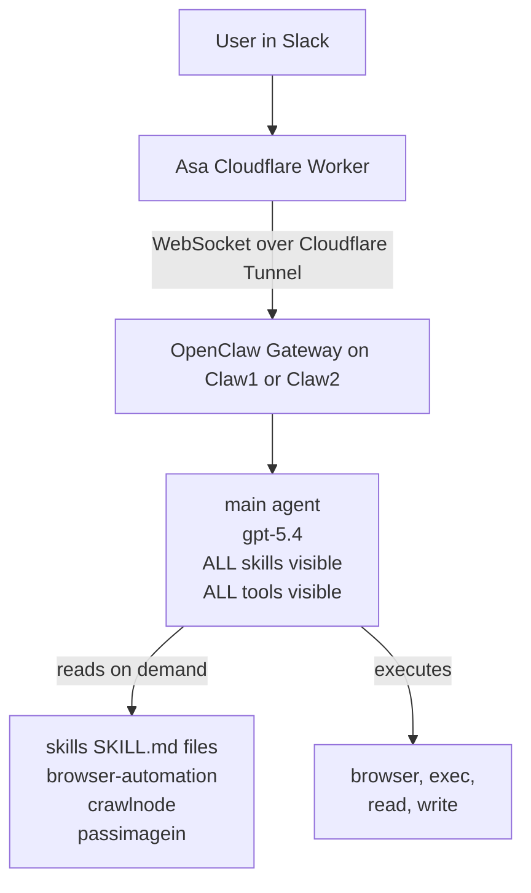
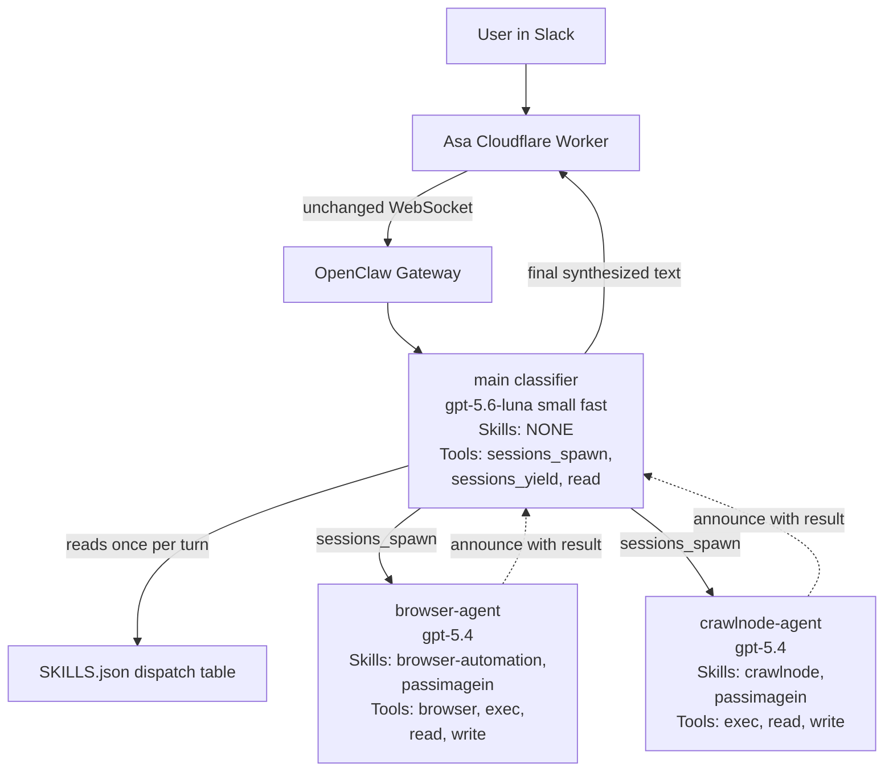
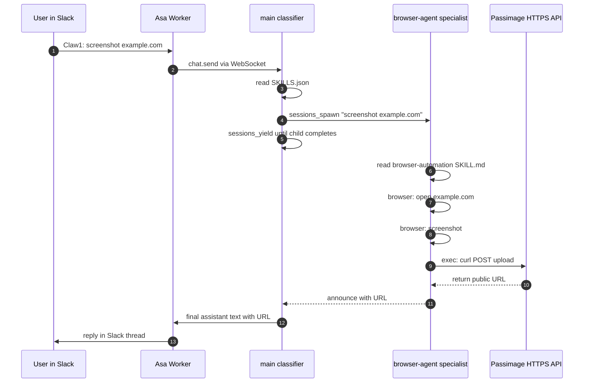

# OpenClaw Multi-Agent Design

**Status:** DRAFT — architecture blueprint for the classifier + specialist refactor.
**Last updated:** August 24, 2026.
**Applies to:** OpenClaw gateways running on Claw1 and Claw2, driven by the [Asa Cloudflare Worker](https://github.com/linkgrid/asa-cf-worker.autoscale.team) from Slack.
**Sister document:** the phase-by-phase implementation plan at `docs/OPENCLAW_MULTI_AGENT_PLAN.md` in the Asa repo.

Written in plain language for non-developers. Every technical term is explained in the glossary below.

---

## 0) Glossary — read this first

If you already know these, skip. If a section confuses you later, come back here.

| Term | Plain-English meaning |
|---|---|
| **Agent** | One AI "brain" with its own workspace, memory, tools, and personality. OpenClaw can host multiple agents on the same machine, each isolated from the others. Today we have one (`main`). We are moving to three. |
| **Skill** | A markdown instructions file (`SKILL.md`) that tells an agent how to do one specific job (e.g. take a screenshot). It's like a company procedures manual. Not code — just prose the AI reads. |
| **Workspace** | A folder on disk that is one agent's "home." Contains its `AGENTS.md` (personality/rules), its local files, its memory. Each agent has a separate one. |
| **`AGENTS.md`** | The system prompt for one agent. Auto-loaded by OpenClaw every time that agent starts a session. Think of it as the agent's job description. |
| **`SKILLS.json`** | A small table listing every skill available on the machine, what each does, and which skills chain together (e.g. `browser-automation` chains with `passimagein`). The classifier reads this to pick specialists. |
| **`sessions_spawn`** | Built-in OpenClaw tool. One agent uses it to hand a task to another agent. Think: making a phone call to a coworker. Non-blocking — the caller doesn't wait. |
| **`sessions_yield`** | Built-in OpenClaw tool. After spawning, the caller uses this to say "wake me up when my coworker finishes." Prevents wasteful waiting. |
| **Depth** | How deep the agent-calling-agent tree goes. Classifier = depth 0. Specialist = depth 1. Sub-sub-agent would be depth 2. We cap at 1 for now (specialists cannot spawn further). |
| **Announce** | When a specialist finishes, OpenClaw automatically delivers its result back to the caller. That delivery is called an "announce." |
| **Classifier** | Nickname for the `main` agent in the new design. Its only job is to pick which specialist should handle each request. It doesn't do the work itself. |
| **Specialist** | Nickname for the sub-agents that do the actual work (`browser-agent`, `crawlnode-agent`, later `calendar-agent`). Each has a narrow skill set. |
| **`SKILL.md` "collaborates_with" field** | A hint in SKILLS.json that says "this skill usually needs to be chained with another." E.g. `browser-automation` collaborates_with `passimagein` because screenshots need to be uploaded to get a URL. |
| **`maxSpawnDepth`** | OpenClaw setting for the depth cap above. `1` = only classifier can spawn. `2` = specialists can also spawn workers. We start at `1`. |
| **Announce** | See above — the delivery of a specialist's result back to the classifier. |
| **`refresh-openclaw.sh`** | A bash script on each Claw that pulls this repo from GitHub and copies the skill/agent files into place, then restarts the gateway. It's the deployment mechanism. |

---

## 1) Problem statement

Today a single OpenClaw agent per Claw does everything: reads the user's Slack message, reads whatever skill file it thinks is relevant, and executes the tools itself. Two failure modes have shown up repeatedly:

1. **Skipped mandatory steps.** The agent takes a screenshot but forgets to upload it to Passimage, so the Slack reply says "here's the screenshot" with no URL. The screenshot exists on disk on the Claw but the user never sees it.
2. **Improvisation after failure.** When the built-in browser tool errors out (e.g. Chrome profile lock), the agent tries workaround after workaround — `exec google-chrome`, `exec chromium`, `write` a script that spawns Playwright — until it hits its 25-minute or 45-tool-call limit and returns nothing. We call this "spiraling."

The root cause of both is the same: **one brain has to remember all the rules for all the skills at once**, and it doesn't. Some rules get dropped.

The [skills repo README](README.md) already draws an aspirational picture of a "classifier + sub-agent" architecture that would solve this, but nothing in the current runtime enforces that picture. It's ASCII art without a backing implementation.

## 2) Current architecture (as-is)

**Weakness in one sentence:** the same agent picks the skill AND executes the skill AND enforces the skill's rules — so any rule it forgets is silently dropped.

## 3) Target architecture (to-be)

**Strength in one sentence:** the classifier picks the right specialist and forwards the reply, but has no way to do the work itself; the specialist does the work with a narrow skill set it can actually hold in its head.

## 4) Component responsibilities

| Component | Where it lives | Job |
|---|---|---|
| **`main` classifier agent** | `~/.openclaw/workspace/AGENTS.md` on each Claw | ONE job: read `SKILLS.json`, pick specialist, `sessions_spawn` it, `sessions_yield`, synthesize the specialist's reply for Asa. Physically cannot run browser, exec, or write (tool allowlist restricts it). |
| **`browser-agent` specialist** | `~/.openclaw/workspace-browser/AGENTS.md` on each Claw | Drives Chromium via the `browser` tool. Captures screenshots. Uses passimagein (as a skill, not a separate agent) to upload files via `exec curl`. Returns the public URL. Cannot spawn further agents. |
| **`crawlnode-agent` specialist** | `~/.openclaw/workspace-crawlnode/AGENTS.md` on each Claw | Same idea but hits the CrawlNode HTTP API via `exec curl` instead of a local browser. Also uses passimagein to upload results. Cannot spawn further agents. |
| **`SKILLS.json`** | Root of [openclaw-skill.crawlnode.com](https://github.com/linkgrid/openclaw-skill.crawlnode.com) | The dispatch table the classifier reads at the start of every turn. Lists each skill's capabilities and its `collaborates_with` chain. Source of truth for what specialists exist. |
| **Per-skill `SKILL.md` files** | Skills repo (`browser-automation/`, `crawlnode/`, `passimagein/`) | The actual instructions each specialist reads. Filtered per-agent by `agents.entries.*.skills` config — the classifier can't see them at all; each specialist sees only its assigned ones. |
| **Per-agent `AGENTS.md` files** | Skills repo, new `agents/` folder (`agents/main/`, `agents/browser-agent/`, `agents/crawlnode-agent/`) | The system prompt for each agent. Auto-loaded by OpenClaw at session start. Deployed by the refresh script into the corresponding workspace folder on each Claw. |
| **`openclaw-config/multi-agent-overlay.json5`** | Skills repo, new `openclaw-config/` folder | The `agents.entries` config chunk merged into `~/.openclaw/openclaw.json` by the refresh script. Defines which agents exist, which model each uses, which skills each sees, which tools each is allowed. |
| **`~/scripts/refresh-openclaw.sh`** | Each Claw filesystem | Extended in this refactor to also sync `agents/*/AGENTS.md` and the config overlay, and to call `openclaw agents add` for any specialist that doesn't yet exist. Idempotent — safe to re-run. |

## 5) Data flow for a screenshot request

Total wall-clock: about 25-30 seconds end to end (about 2-4 seconds slower than today because of the extra classifier turn and hand-off).

## 6) Cost estimate

| Component per request | Approximate cost |
|---|---|
| Classifier turn (`gpt-5.6-luna`, ~1000 in / 200 out tokens) | ~$0.001 |
| Specialist turn (`gpt-5.4`, roughly today's whole-run cost) | ~$0.05 |
| **Total** | **~$0.051 (about 2% more than today)** |

Negligible in practice.

## 7) Risks and mitigations

| What could go wrong | Why it's a worry | How we prevent it |
|---|---|---|
| Classifier tries to answer directly instead of calling the specialist | The AI is lazy sometimes. It might invent a fake screenshot URL to save time. | Restrict its tools to `sessions_spawn`, `sessions_yield`, `read`, `agents_list` only. It physically cannot open a browser or run commands, so it must delegate. |
| Sub-agent spawning doesn't work end to end when the request comes from Slack | Slack messages route through a "channel adapter." Some OpenClaw tools have quirks in that path. We haven't proven `sessions_spawn` works there yet. | Phase 0 of the implementation plan is a 15-minute recon on Claw1 that tests exactly this before we build anything. If it fails, we stop and re-plan. |
| Claw1 and Claw2 drift apart on skill/agent versions | If we only update one machine, one Claw behaves one way and the other differently. Debugging nightmare. | Both Claws run the same refresh script that pulls the same commit from this repo. Verified after each deploy with `openclaw skills check --agent browser-agent`. |
| Something breaks mid-deploy on one Claw | The Claw is unusable until we fix it. | Every phase saves a timestamped backup of what it changes (`openclaw.json.bak.pre-multi-agent-*`, `refresh-openclaw.sh.bak.pre-multi-agent-*`). Rollback = restore the backup. |
| Existing conversation history disappears | The `main` agent has months of session data in its SQLite store. | We don't delete `main` — we change its config and its workspace `AGENTS.md`. All the session data stays intact. |
| Classifier picks the wrong specialist | E.g. routes a screenshot request to `crawlnode-agent` when the user wanted the local browser. | The `main/AGENTS.md` prompt has explicit routing rules ("if user says `crawlnode` → crawlnode-agent, else → browser-agent"). And Phase 5 tests both paths three times each. |

## 8) Whole-system rollback

Per Claw, in order:

1. `mv ~/.openclaw/openclaw.json.bak.pre-multi-agent-<timestamp> ~/.openclaw/openclaw.json`
2. `mv ~/scripts/refresh-openclaw.sh.bak.pre-multi-agent-<date> ~/scripts/refresh-openclaw.sh`
3. `openclaw agents delete browser-agent --force`
4. `openclaw agents delete crawlnode-agent --force`
5. `cp ~/.openclaw/workspace/AGENTS.md.bak.pre-multi-agent-<timestamp> ~/.openclaw/workspace/AGENTS.md`
6. `systemctl --user restart openclaw-gateway`

Zero changes in Asa's code, so Asa needs no rollback.

## 9) Non-goals and future work

### Explicit non-goals for this refactor

- **No changes to Asa's runtime code.** Asa remains a dumb middleman. All routing and orchestration is on the OpenClaw side.
- **No use of OpenClaw channel bindings for content-based routing.** Bindings key on `(channel, account, peer)` — the wrong tool for our job of "look at the message content and pick a specialist." Classifier prompt does that instead.
- **No nested sub-agents (`maxSpawnDepth: 1`).** Specialists cannot spawn their own sub-agents. Simpler to reason about, no risk of runaway loops. We can raise this to 2 later if a real use case appears (e.g. an orchestrator specialist that fans out to workers).
- **No separate `passimagein-agent`.** Passimage is a helper skill (uploads a file, returns URL) that on its own has nothing to do. It's loaded into `browser-agent` and `crawlnode-agent` as a shared library. Any future agent that produces files will also load it.

### Deferred to a future phase (planned, not built yet)

- **`calendar-schedule` skill + `calendar-agent` specialist.** Google Calendar create/update/cancel/list via the existing service account with domain-wide delegation (credentials already exist in Asa's env). Deferred until the three-agent classifier is proven stable in production. When added, follows the exact same pattern: new folder in this repo, new AGENTS.md, one new entry in the multi-agent-overlay.json5, refresh script picks it up.
- **Other specialist agents as needed.** Any future workflow (Slack summaries, PDF generation, chart rendering, email drafting, etc.) can be added as a new specialist without touching the classifier or existing specialists. The classifier just gets a new row in `SKILLS.json` and a new "if user asks X, spawn Y" rule in its `AGENTS.md`.

## 10) Related documents

- **Implementation plan (phase-by-phase, with rollback per phase):** `docs/OPENCLAW_MULTI_AGENT_PLAN.md` in the [Asa repo](https://github.com/linkgrid/asa-cf-worker.autoscale.team/blob/main/docs/OPENCLAW_MULTI_AGENT_PLAN.md).
- **Overall OpenClaw operating context (Slack integration, admin panel, day-to-day operations):** `docs/OPENCLAW_WORKING_CONTEXT.md` in the Asa repo.
- **Skills repo README (the aspirational architecture picture this design finally realizes):** [README.md](README.md).
- **OpenClaw upstream docs used to inform this design:**
  - Multi-agent routing: `https://docs.openclaw.ai/concepts/multi-agent`
  - Sub-agents (`sessions_spawn` / `sessions_yield`): `https://docs.openclaw.ai/tools/subagents`
  - Agent workspace + AGENTS.md: `https://docs.openclaw.ai/concepts/agent-workspace`
  - Skills config (per-agent visibility): `https://docs.openclaw.ai/tools/skills-config`
